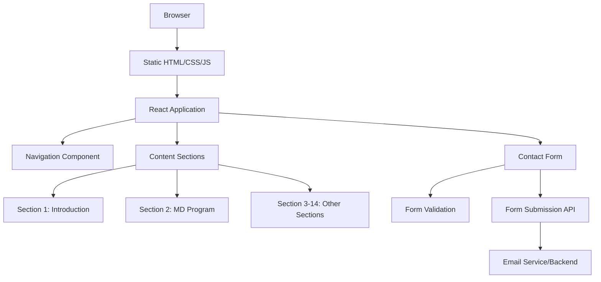

# Design Document: SEU Medical Education Website

## Overview

The SEU Medical Education Website is a single-page promotional website designed to attract Indian students to Georgian National University SEU's medical education program. The site serves as the primary digital touchpoint for prospective students, providing comprehensive information about studying medicine in Georgia.

### Design Goals

1. **Information Architecture**: Present 14 distinct content sections in a logical, scannable flow that guides visitors from awareness to action
2. **User Experience**: Create a smooth, responsive experience across all devices (mobile-first approach given target audience)
3. **Performance**: Ensure fast load times (<3s) for users in India with varying connection speeds
4. **Accessibility**: Meet WCAG AA standards to ensure all prospective students can access information
5. **Maintainability**: Structure code to allow easy content updates without requiring developer intervention

### Technology Stack

**Frontend Framework**: React 18+ with TypeScript
- Component-based architecture for reusability and maintainability
- Strong typing for better code quality and developer experience
- Rich ecosystem for tooling and libraries

**Styling**: Tailwind CSS
- Utility-first approach for rapid development
- Built-in responsive design utilities
- Easy to maintain consistent design system
- Excellent performance with PurgeCSS

**Build Tool**: Vite
- Fast development server with HMR
- Optimized production builds
- Modern ES modules support

**Form Handling**: React Hook Form + Zod
- Performant form validation
- Type-safe schema validation
- Excellent developer experience

**Animations**: Framer Motion
- Smooth scroll animations and transitions
- Performant animations using CSS transforms
- Declarative animation API

**Deployment**: Static hosting (Netlify/Vercel)
- CDN distribution for global performance
- Automatic deployments from Git
- Built-in form handling capabilities

### Architecture

The website follows a **single-page application (SPA)** architecture with the following characteristics:

1. **Component-Based Structure**: Each content section is an independent React component
2. **Static Generation**: Pre-rendered at build time for optimal performance
3. **Client-Side Navigation**: Smooth scrolling between sections without page reloads
4. **Progressive Enhancement**: Core content accessible even if JavaScript fails

#### High-Level Architecture



#### Component Hierarchy

```
App
├── Header
│   ├── Logo
│   ├── Navigation
│   │   ├── DesktopNav
│   │   └── MobileNav (hamburger menu)
│   └── CTAButton
├── Main
│   ├── HeroSection
│   ├── IntroductionSection
│   ├── UniversitySection
│   ├── MDProgramSection
│   ├── EligibilitySection
│   ├── FeesSection
│   ├── SupportServicesSection
│   ├── AdmissionProcessSection
│   ├── DocumentsSection
│   ├── VisaProcessSection
│   ├── StudentLifeSection
│   ├── CareerSection
│   ├── FAQSection
│   └── ContactSection
│       └── ContactForm
└── Footer
    ├── QuickLinks
    ├── ContactInfo
    └── SocialMedia
```

## Components and Interfaces

### Core Components

#### 1. Navigation Component

**Purpose**: Provides persistent navigation across all sections with responsive behavior

**Props Interface**:
```typescript
interface NavigationProps {
  sections: NavigationSection[];
  activeSection: string;
  onNavigate: (sectionId: string) => void;
}

interface NavigationSection {
  id: string;
  label: string;
  href: string;
}
```

**Behavior**:
- Sticky positioning on desktop (remains visible while scrolling)
- Hamburger menu on mobile (<768px)
- Active section highlighting based on scroll position
- Smooth scroll to section on click
- Closes mobile menu after navigation

**Accessibility**:
- Keyboard navigable (Tab, Enter, Escape)
- ARIA labels for mobile menu button
- Focus trap in mobile menu when open

#### 2. Section Component (Base)

**Purpose**: Reusable wrapper for content sections with consistent spacing and layout

**Props Interface**:
```typescript
interface SectionProps {
  id: string;
  title: string;
  subtitle?: string;
  children: React.ReactNode;
  background?: 'white' | 'gray' | 'accent';
  className?: string;
}
```

**Features**:
- Consistent padding and margins
- Scroll margin for navigation offset
- Intersection observer for scroll-based animations
- Alternating background colors for visual separation

#### 3. ContactForm Component

**Purpose**: Handles visitor inquiries with validation and submission

**Props Interface**:
```typescript
interface ContactFormProps {
  onSubmit: (data: ContactFormData) => Promise<void>;
  onSuccess?: () => void;
  onError?: (error: Error) => void;
}

interface ContactFormData {
  name: string;
  email: string;
  phone: string;
  message: string;
  preferredContact?: 'email' | 'phone';
}
```

**Validation Rules**:
- Name: Required, 2-100 characters
- Email: Required, valid email format
- Phone: Required, valid Indian phone format (+91 or 10 digits)
- Message: Required, 10-1000 characters
- Preferred contact: Optional

**States**:
- Idle: Initial state
- Validating: Client-side validation in progress
- Submitting: Form data being sent
- Success: Submission successful, show confirmation
- Error: Submission failed, show error message

**Error Handling**:
- Field-level validation errors displayed inline
- Form-level errors displayed at top
- Network errors handled gracefully with retry option

#### 4. FAQ Component

**Purpose**: Displays frequently asked questions with expandable answers

**Props Interface**:
```typescript
interface FAQProps {
  categories: FAQCategory[];
}

interface FAQCategory {
  id: string;
  title: string;
  questions: FAQItem[];
}

interface FAQItem {
  id: string;
  question: string;
  answer: string;
}
```

**Behavior**:
- Accordion-style expansion (one open at a time per category)
- Smooth height transitions
- Keyboard accessible (Space/Enter to toggle)
- Deep linking support (URL hash to specific question)

#### 5. InfoCard Component

**Purpose**: Reusable card for displaying structured information (fees, documents, etc.)

**Props Interface**:
```typescript
interface InfoCardProps {
  title: string;
  description?: string;
  items?: string[];
  icon?: React.ReactNode;
  highlight?: boolean;
  variant?: 'default' | 'bordered' | 'elevated';
}
```

#### 6. ProcessStep Component

**Purpose**: Displays sequential process steps (admission, visa)

**Props Interface**:
```typescript
interface ProcessStepProps {
  steps: ProcessStep[];
  orientation?: 'vertical' | 'horizontal';
}

interface ProcessStep {
  id: string;
  title: string;
  description: string;
  timeline?: string;
  icon?: React.ReactNode;
}
```

### Utility Functions

#### Scroll Management

```typescript
// Smooth scroll to section with offset for fixed header
function scrollToSection(sectionId: string, offset: number = 80): void;

// Get current active section based on scroll position
function getActiveSection(sections: string[]): string;

// Intersection observer hook for scroll animations
function useScrollAnimation(threshold: number = 0.1): {
  ref: React.RefObject<HTMLElement>;
  isVisible: boolean;
};
```

#### Form Utilities

```typescript
// Validate Indian phone number
function validateIndianPhone(phone: string): boolean;

// Format phone number for display
function formatPhoneNumber(phone: string): string;

// Sanitize form input
function sanitizeInput(input: string): string;
```

#### Responsive Utilities

```typescript
// Hook for responsive breakpoints
function useBreakpoint(): 'mobile' | 'tablet' | 'desktop';

// Hook for detecting mobile device
function useIsMobile(): boolean;
```

## Data Models

### Content Data Structure

All content is stored in structured TypeScript objects for type safety and easy maintenance.

#### Site Configuration

```typescript
interface SiteConfig {
  siteName: string;
  tagline: string;
  description: string;
  keywords: string[];
  contact: ContactInfo;
  social: SocialLinks;
}

interface ContactInfo {
  email: string;
  phone: string;
  whatsapp?: string;
  address: Address;
}

interface Address {
  street: string;
  city: string;
  country: string;
  postalCode: string;
}

interface SocialLinks {
  facebook?: string;
  instagram?: string;
  youtube?: string;
  linkedin?: string;
}
```

#### Section Content Models

```typescript
// Introduction Section
interface IntroductionContent {
  heading: string;
  subheading: string;
  highlights: string[];
  ctaText: string;
  ctaLink: string;
}

// University Section
interface UniversityContent {
  name: string;
  foundingYear: number;
  location: string;
  accreditations: Accreditation[];
  highlights: string[];
  description: string;
}

interface Accreditation {
  name: string;
  description: string;
  logo?: string;
}

// MD Program Section
interface MDProgramContent {
  duration: string;
  language: string;
  curriculum: CurriculumPhase[];
  clinicalTraining: string;
  highlights: string[];
}

interface CurriculumPhase {
  years: string;
  title: string;
  description: string;
  subjects?: string[];
}

// Eligibility Section
interface EligibilityContent {
  minimumEducation: string;
  requiredSubjects: string[];
  neetRequirement: string;
  additionalCriteria: string[];
  ageRequirement?: string;
}

// Fees Section
interface FeesContent {
  tuition: FeeRange;
  accommodation: AccommodationOption[];
  living: LivingExpenses;
  currency: string;
}

interface FeeRange {
  min: number;
  max: number;
  period: string;
}

interface AccommodationOption {
  type: string;
  cost: number;
  period: string;
  description: string;
}

interface LivingExpenses {
  food: FeeRange;
  transportation: FeeRange;
  miscellaneous: FeeRange;
}

// Support Services Section
interface SupportServicesContent {
  overview: string;
  services: SupportService[];
}

interface SupportService {
  title: string;
  description: string;
  icon: string;
  phase: 'pre-arrival' | 'arrival' | 'academic' | 'ongoing';
}

// Admission Process Section
interface AdmissionProcessContent {
  overview: string;
  steps: ProcessStep[];
}

// Documents Section
interface DocumentsContent {
  overview: string;
  required: Document[];
  optional?: Document[];
}

interface Document {
  name: string;
  description: string;
  format?: string;
  certification?: string;
}

// Visa Process Section
interface VisaProcessContent {
  visaType: string;
  overview: string;
  steps: ProcessStep[];
  requiredDocuments: string[];
  timeline: string;
  tips: string[];
}

// Student Life Section
interface StudentLifeContent {
  arrival: string[];
  culture: string[];
  accommodation: string[];
  safety: string[];
  activities: string[];
}

// Career Section
interface CareerContent {
  overview: string;
  opportunities: CareerOpportunity[];
  recognition: Recognition[];
  successStories?: SuccessStory[];
}

interface CareerOpportunity {
  title: string;
  description: string;
  countries?: string[];
}

interface Recognition {
  organization: string;
  description: string;
  logo?: string;
}

interface SuccessStory {
  name: string;
  graduationYear: number;
  currentPosition: string;
  testimonial: string;
  photo?: string;
}

// FAQ Section
interface FAQContent {
  categories: FAQCategory[];
}
```

### Form Data Models

```typescript
// Contact Form Submission
interface ContactFormSubmission {
  id: string;
  timestamp: Date;
  data: ContactFormData;
  status: 'pending' | 'sent' | 'failed';
  ipAddress?: string;
  userAgent?: string;
}

// Form Validation Schema (Zod)
const contactFormSchema = z.object({
  name: z.string()
    .min(2, 'Name must be at least 2 characters')
    .max(100, 'Name must be less than 100 characters'),
  email: z.string()
    .email('Please enter a valid email address'),
  phone: z.string()
    .regex(/^(\+91|0)?[6-9]\d{9}$/, 'Please enter a valid Indian phone number'),
  message: z.string()
    .min(10, 'Message must be at least 10 characters')
    .max(1000, 'Message must be less than 1000 characters'),
  preferredContact: z.enum(['email', 'phone']).optional(),
});
```

### Navigation Data Model

```typescript
interface NavigationStructure {
  sections: NavigationSection[];
}

const navigationData: NavigationStructure = {
  sections: [
    { id: 'introduction', label: 'About', href: '#introduction' },
    { id: 'university', label: 'University', href: '#university' },
    { id: 'md-program', label: 'MD Program', href: '#md-program' },
    { id: 'eligibility', label: 'Eligibility', href: '#eligibility' },
    { id: 'fees', label: 'Fees', href: '#fees' },
    { id: 'support', label: 'Support', href: '#support' },
    { id: 'admission', label: 'Admission', href: '#admission' },
    { id: 'documents', label: 'Documents', href: '#documents' },
    { id: 'visa', label: 'Visa', href: '#visa' },
    { id: 'student-life', label: 'Student Life', href: '#student-life' },
    { id: 'career', label: 'Career', href: '#career' },
    { id: 'faq', label: 'FAQ', href: '#faq' },
    { id: 'contact', label: 'Contact', href: '#contact' },
  ],
};
```

### Performance Optimization Data

```typescript
// Image optimization configuration
interface ImageConfig {
  src: string;
  alt: string;
  width: number;
  height: number;
  loading: 'lazy' | 'eager';
  formats: ('webp' | 'avif' | 'jpg' | 'png')[];
}

// Lazy loading configuration
interface LazyLoadConfig {
  threshold: number;
  rootMargin: string;
  triggerOnce: boolean;
}
```

## UI/UX Design Approach

### Design System

#### Color Palette

```typescript
const colors = {
  primary: {
    50: '#f0f9ff',
    100: '#e0f2fe',
    500: '#0ea5e9',  // Main brand color
    600: '#0284c7',
    700: '#0369a1',
  },
  secondary: {
    500: '#f59e0b',  // Accent/CTA color
    600: '#d97706',
  },
  neutral: {
    50: '#f9fafb',
    100: '#f3f4f6',
    200: '#e5e7eb',
    500: '#6b7280',
    700: '#374151',
    900: '#111827',
  },
  success: '#10b981',
  error: '#ef4444',
  warning: '#f59e0b',
};
```

#### Typography

```typescript
const typography = {
  fontFamily: {
    sans: ['Inter', 'system-ui', 'sans-serif'],
    heading: ['Poppins', 'Inter', 'sans-serif'],
  },
  fontSize: {
    xs: '0.75rem',    // 12px
    sm: '0.875rem',   // 14px
    base: '1rem',     // 16px
    lg: '1.125rem',   // 18px
    xl: '1.25rem',    // 20px
    '2xl': '1.5rem',  // 24px
    '3xl': '1.875rem', // 30px
    '4xl': '2.25rem', // 36px
    '5xl': '3rem',    // 48px
  },
  lineHeight: {
    tight: 1.25,
    normal: 1.5,
    relaxed: 1.75,
  },
};
```

#### Spacing System

Following an 8px grid system:
- Base unit: 8px
- Scale: 4px, 8px, 16px, 24px, 32px, 48px, 64px, 96px, 128px

#### Breakpoints

```typescript
const breakpoints = {
  sm: '640px',   // Mobile landscape
  md: '768px',   // Tablet
  lg: '1024px',  // Desktop
  xl: '1280px',  // Large desktop
  '2xl': '1536px', // Extra large desktop
};
```

### Layout Patterns

#### Mobile-First Responsive Layout

1. **Mobile (320px - 767px)**:
   - Single column layout
   - Hamburger navigation
   - Stacked cards and content
   - Touch-optimized buttons (min 44px height)
   - Reduced padding and margins

2. **Tablet (768px - 1023px)**:
   - Two-column layouts where appropriate
   - Expanded navigation (may still use hamburger)
   - Side-by-side cards
   - Increased spacing

3. **Desktop (1024px+)**:
   - Multi-column layouts
   - Full horizontal navigation
   - Grid-based card layouts
   - Maximum content width: 1280px (centered)
   - Generous spacing

### Interaction Patterns

#### Scroll Behavior

- Smooth scrolling between sections
- Scroll-triggered animations (fade-in, slide-up)
- Parallax effects on hero section (subtle)
- Progress indicator showing position in page

#### Navigation Behavior

- Active section highlighting in navigation
- Sticky header on desktop
- Mobile menu slides in from right
- Overlay backdrop when mobile menu open
- Auto-close mobile menu on navigation

#### Form Interactions

- Real-time validation on blur
- Inline error messages
- Success confirmation modal
- Loading state during submission
- Disabled submit button during validation/submission

#### Micro-interactions

- Button hover states (scale, color change)
- Card hover effects (elevation, border)
- Link underline animations
- Icon animations on hover
- Smooth transitions (200-300ms)

### Accessibility Considerations

1. **Keyboard Navigation**:
   - All interactive elements focusable
   - Logical tab order
   - Skip to main content link
   - Focus visible indicators

2. **Screen Readers**:
   - Semantic HTML (header, nav, main, section, footer)
   - ARIA labels for icon buttons
   - Alt text for all images
   - Proper heading hierarchy (h1 → h2 → h3)

3. **Visual Accessibility**:
   - Color contrast ratio ≥ 4.5:1 for normal text
   - Color contrast ratio ≥ 3:1 for large text
   - Don't rely on color alone for information
   - Sufficient spacing between interactive elements

4. **Motion Accessibility**:
   - Respect prefers-reduced-motion
   - Disable animations for users who prefer reduced motion
   - No auto-playing videos with sound

### Content Presentation Strategy

#### Information Hierarchy

1. **Hero Section**: Immediate value proposition
2. **Introduction**: Why study in Georgia
3. **University**: Credibility and trust
4. **Program Details**: Core offering
5. **Practical Information**: Eligibility, fees, process
6. **Support & Life**: Addressing concerns
7. **Career**: Long-term value
8. **FAQ**: Quick answers
9. **Contact**: Conversion point

#### Content Formatting

- **Scannable**: Use headings, bullet points, short paragraphs
- **Visual**: Include icons, images, and infographics
- **Progressive Disclosure**: Show overview, expand for details
- **Consistent**: Same patterns across sections

#### Call-to-Action Strategy

- Primary CTA: "Apply Now" / "Contact Us"
- Secondary CTA: "Download Brochure" / "Schedule Call"
- CTA placement: Hero, after key sections, footer
- CTA design: High contrast, prominent, action-oriented text


## Implementation Details

### Project Structure

```
seu-medical-education-website/
├── public/
│   ├── images/
│   │   ├── hero/
│   │   ├── university/
│   │   ├── student-life/
│   │   └── icons/
│   └── favicon.ico
├── src/
│   ├── components/
│   │   ├── common/
│   │   │   ├── Button.tsx
│   │   │   ├── Card.tsx
│   │   │   ├── Section.tsx
│   │   │   └── Icon.tsx
│   │   ├── layout/
│   │   │   ├── Header.tsx
│   │   │   ├── Navigation.tsx
│   │   │   ├── MobileMenu.tsx
│   │   │   └── Footer.tsx
│   │   ├── sections/
│   │   │   ├── HeroSection.tsx
│   │   │   ├── IntroductionSection.tsx
│   │   │   ├── UniversitySection.tsx
│   │   │   ├── MDProgramSection.tsx
│   │   │   ├── EligibilitySection.tsx
│   │   │   ├── FeesSection.tsx
│   │   │   ├── SupportServicesSection.tsx
│   │   │   ├── AdmissionProcessSection.tsx
│   │   │   ├── DocumentsSection.tsx
│   │   │   ├── VisaProcessSection.tsx
│   │   │   ├── StudentLifeSection.tsx
│   │   │   ├── CareerSection.tsx
│   │   │   ├── FAQSection.tsx
│   │   │   └── ContactSection.tsx
│   │   └── forms/
│   │       ├── ContactForm.tsx
│   │       └── FormField.tsx
│   ├── data/
│   │   ├── siteConfig.ts
│   │   ├── navigationData.ts
│   │   ├── contentData.ts
│   │   └── faqData.ts
│   ├── hooks/
│   │   ├── useScrollAnimation.ts
│   │   ├── useActiveSection.ts
│   │   ├── useBreakpoint.ts
│   │   └── useFormSubmission.ts
│   ├── utils/
│   │   ├── scrollTo.ts
│   │   ├── validation.ts
│   │   └── formatting.ts
│   ├── types/
│   │   ├── content.ts
│   │   ├── forms.ts
│   │   └── navigation.ts
│   ├── styles/
│   │   └── globals.css
│   ├── App.tsx
│   └── main.tsx
├── package.json
├── tsconfig.json
├── tailwind.config.js
├── vite.config.ts
└── README.md
```

### Key Implementation Considerations

#### 1. Content Management

**Approach**: Structured data files in TypeScript
- All content stored in `src/data/` directory
- Type-safe content models
- Easy to update without touching components
- Can be migrated to CMS later if needed

**Example Content File**:
```typescript
// src/data/contentData.ts
export const universityContent: UniversityContent = {
  name: 'Georgian National University SEU',
  foundingYear: 2001,
  location: 'Tbilisi, Georgia',
  accreditations: [
    {
      name: 'WHO',
      description: 'World Health Organization',
    },
    {
      name: 'NMC',
      description: 'National Medical Commission (India)',
    },
  ],
  highlights: [
    'English-medium instruction',
    'Affordable tuition fees',
    'European education standards',
    'Modern facilities and equipment',
  ],
  description: 'Established in 2001, SEU is a leading medical university...',
};
```

#### 2. Form Submission Handling

**Options**:

**Option A: Netlify Forms** (Recommended for MVP)
- Built-in form handling
- No backend required
- Email notifications
- Spam protection
- Simple integration

**Option B: Custom API Endpoint**
- More control over data
- Can integrate with CRM
- Requires backend service
- More complex setup

**Implementation (Netlify)**:
```typescript
async function submitContactForm(data: ContactFormData): Promise<void> {
  const formData = new FormData();
  formData.append('name', data.name);
  formData.append('email', data.email);
  formData.append('phone', data.phone);
  formData.append('message', data.message);
  
  const response = await fetch('/', {
    method: 'POST',
    headers: { 'Content-Type': 'application/x-www-form-urlencoded' },
    body: new URLSearchParams(formData as any).toString(),
  });
  
  if (!response.ok) {
    throw new Error('Form submission failed');
  }
}
```

#### 3. Image Optimization

**Strategy**:
- Use WebP format with JPEG fallback
- Responsive images with srcset
- Lazy loading for below-fold images
- Eager loading for hero image
- Compress images to <200KB each

**Implementation**:
```typescript
interface OptimizedImageProps {
  src: string;
  alt: string;
  width: number;
  height: number;
  loading?: 'lazy' | 'eager';
}

function OptimizedImage({ src, alt, width, height, loading = 'lazy' }: OptimizedImageProps) {
  return (
    <picture>
      <source srcSet={`${src}.webp`} type="image/webp" />
      
    </picture>
  );
}
```

#### 4. Scroll Management

**Active Section Detection**:
```typescript
function useActiveSection(sectionIds: string[]): string {
  const [activeSection, setActiveSection] = useState(sectionIds[0]);
  
  useEffect(() => {
    const observer = new IntersectionObserver(
      (entries) => {
        entries.forEach((entry) => {
          if (entry.isIntersecting) {
            setActiveSection(entry.target.id);
          }
        });
      },
      {
        rootMargin: '-80px 0px -80% 0px', // Account for header height
        threshold: 0,
      }
    );
    
    sectionIds.forEach((id) => {
      const element = document.getElementById(id);
      if (element) observer.observe(element);
    });
    
    return () => observer.disconnect();
  }, [sectionIds]);
  
  return activeSection;
}
```

**Smooth Scrolling**:
```typescript
function scrollToSection(sectionId: string, offset: number = 80): void {
  const element = document.getElementById(sectionId);
  if (!element) return;
  
  const elementPosition = element.getBoundingClientRect().top;
  const offsetPosition = elementPosition + window.pageYOffset - offset;
  
  window.scrollTo({
    top: offsetPosition,
    behavior: 'smooth',
  });
}
```

#### 5. Responsive Navigation

**Desktop Navigation**:
- Horizontal menu bar
- Sticky positioning
- Hover effects
- Active section highlighting

**Mobile Navigation**:
- Hamburger icon button
- Slide-in drawer from right
- Overlay backdrop
- Close on navigation or backdrop click
- Focus trap when open

**Implementation Pattern**:
```typescript
function Navigation() {
  const [isMobileMenuOpen, setIsMobileMenuOpen] = useState(false);
  const isMobile = useBreakpoint() === 'mobile';
  const activeSection = useActiveSection(navigationData.sections.map(s => s.id));
  
  return (
    <>
      {isMobile ? (
        <MobileMenu
          isOpen={isMobileMenuOpen}
          onClose={() => setIsMobileMenuOpen(false)}
          sections={navigationData.sections}
          activeSection={activeSection}
        />
      ) : (
        <DesktopNav
          sections={navigationData.sections}
          activeSection={activeSection}
        />
      )}
    </>
  );
}
```

#### 6. Animation Strategy

**Scroll Animations**:
- Fade in on scroll
- Slide up on scroll
- Stagger animations for lists
- Respect prefers-reduced-motion

**Implementation**:
```typescript
function useScrollAnimation(threshold: number = 0.1) {
  const ref = useRef<HTMLElement>(null);
  const [isVisible, setIsVisible] = useState(false);
  
  useEffect(() => {
    const prefersReducedMotion = window.matchMedia(
      '(prefers-reduced-motion: reduce)'
    ).matches;
    
    if (prefersReducedMotion) {
      setIsVisible(true);
      return;
    }
    
    const observer = new IntersectionObserver(
      ([entry]) => {
        if (entry.isIntersecting) {
          setIsVisible(true);
        }
      },
      { threshold }
    );
    
    if (ref.current) {
      observer.observe(ref.current);
    }
    
    return () => observer.disconnect();
  }, [threshold]);
  
  return { ref, isVisible };
}
```

#### 7. Performance Optimization

**Code Splitting**:
- Lazy load FAQ section (below fold)
- Lazy load contact form
- Dynamic imports for heavy components

**Asset Optimization**:
- Minify CSS and JavaScript
- Tree-shake unused code
- Compress images
- Use CDN for static assets

**Loading Strategy**:
```typescript
// Lazy load below-fold sections
const FAQSection = lazy(() => import('./sections/FAQSection'));
const ContactSection = lazy(() => import('./sections/ContactSection'));

function App() {
  return (
    <Suspense fallback={<LoadingSpinner />}>
      {/* Above-fold content loads immediately */}
      <HeroSection />
      <IntroductionSection />
      
      {/* Below-fold content lazy loads */}
      <FAQSection />
      <ContactSection />
    </Suspense>
  );
}
```

**Performance Metrics**:
- First Contentful Paint (FCP): <1.5s
- Largest Contentful Paint (LCP): <2.5s
- Time to Interactive (TTI): <3.0s
- Cumulative Layout Shift (CLS): <0.1

#### 8. SEO Optimization

**Meta Tags**:
```typescript
// In index.html or using react-helmet
<head>
  <title>Study MBBS in Georgia | Georgian National University SEU</title>
  <meta name="description" content="Study medicine at Georgian National University SEU. Affordable MD program in English for Indian students. WHO & NMC recognized." />
  <meta name="keywords" content="MBBS in Georgia, study medicine abroad, SEU Georgia, medical university Georgia, Indian students" />
  
  {/* Open Graph */}
  <meta property="og:title" content="Study MBBS in Georgia | SEU" />
  <meta property="og:description" content="Affordable medical education in English" />
  <meta property="og:image" content="/images/og-image.jpg" />
  <meta property="og:type" content="website" />
  
  {/* Structured Data */}
  <script type="application/ld+json">
    {JSON.stringify({
      "@context": "https://schema.org",
      "@type": "EducationalOrganization",
      "name": "Georgian National University SEU",
      "url": "https://seu-medical.com",
      "logo": "/images/logo.png",
      "contactPoint": {
        "@type": "ContactPoint",
        "telephone": "+995-XXX-XXX-XXX",
        "contactType": "Admissions"
      }
    })}
  </script>
</head>
```

**Semantic HTML**:
- Proper heading hierarchy
- Semantic elements (header, nav, main, section, article, footer)
- Descriptive link text
- Alt text for images

#### 9. Accessibility Implementation

**Keyboard Navigation**:
```typescript
// Skip to main content link
<a href="#main" className="sr-only focus:not-sr-only">
  Skip to main content
</a>

// Focus management in mobile menu
function MobileMenu({ isOpen, onClose }) {
  const menuRef = useRef<HTMLDivElement>(null);
  
  useEffect(() => {
    if (isOpen) {
      // Trap focus in menu
      const focusableElements = menuRef.current?.querySelectorAll(
        'a, button, [tabindex]:not([tabindex="-1"])'
      );
      const firstElement = focusableElements?.[0] as HTMLElement;
      firstElement?.focus();
    }
  }, [isOpen]);
  
  return (
    <div ref={menuRef} role="dialog" aria-modal="true">
      {/* Menu content */}
    </div>
  );
}
```

**ARIA Labels**:
```typescript
// Navigation
<nav aria-label="Main navigation">
  <ul>
    <li><a href="#about">About</a></li>
  </ul>
</nav>

// Mobile menu button
<button
  aria-label="Open navigation menu"
  aria-expanded={isOpen}
  onClick={() => setIsOpen(true)}
>
  <MenuIcon />
</button>

// Form fields
<label htmlFor="email">Email Address</label>
<input
  id="email"
  type="email"
  aria-required="true"
  aria-invalid={!!errors.email}
  aria-describedby={errors.email ? "email-error" : undefined}
/>
{errors.email && (
  <span id="email-error" role="alert">
    {errors.email.message}
  </span>
)}
```

**Color Contrast**:
- Text on white: #374151 (neutral-700) - 10.5:1 ratio
- Links: #0ea5e9 (primary-500) - 4.5:1 ratio
- Buttons: White text on #0ea5e9 - 4.5:1 ratio

#### 10. Testing Strategy

**Unit Tests** (Vitest + React Testing Library):
- Component rendering
- Form validation logic
- Utility functions
- User interactions

**Integration Tests**:
- Navigation flow
- Form submission
- Scroll behavior
- Responsive behavior

**E2E Tests** (Playwright):
- Complete user journey
- Form submission end-to-end
- Cross-browser testing
- Mobile device testing

**Accessibility Tests**:
- axe-core integration
- Keyboard navigation testing
- Screen reader testing (manual)

**Performance Tests**:
- Lighthouse CI
- Bundle size monitoring
- Load time testing

### Deployment Strategy

**Build Process**:
1. Run type checking (`tsc --noEmit`)
2. Run linting (`eslint`)
3. Run tests (`vitest run`)
4. Build production bundle (`vite build`)
5. Run Lighthouse audit
6. Deploy to hosting

**Hosting Configuration** (Netlify):
```toml
# netlify.toml
[build]
  command = "npm run build"
  publish = "dist"

[[redirects]]
  from = "/*"
  to = "/index.html"
  status = 200

[build.environment]
  NODE_VERSION = "18"

[[headers]]
  for = "/*"
  [headers.values]
    X-Frame-Options = "DENY"
    X-Content-Type-Options = "nosniff"
    Referrer-Policy = "strict-origin-when-cross-origin"

[[headers]]
  for = "/assets/*"
  [headers.values]
    Cache-Control = "public, max-age=31536000, immutable"
```

**Environment Variables**:
```
VITE_FORM_ENDPOINT=https://api.example.com/contact
VITE_SITE_URL=https://seu-medical.com
VITE_GA_TRACKING_ID=UA-XXXXXXXXX-X
```

### Maintenance and Updates

**Content Updates**:
1. Edit content files in `src/data/`
2. Type checking ensures data structure integrity
3. Preview changes locally
4. Commit and push to trigger deployment

**Adding New Sections**:
1. Create section component in `src/components/sections/`
2. Add content data to `src/data/contentData.ts`
3. Add navigation entry to `src/data/navigationData.ts`
4. Import and render in `App.tsx`

**Updating Styles**:
1. Modify Tailwind configuration for design system changes
2. Update component classes for specific changes
3. Maintain consistency with design system


## Correctness Properties

*A property is a characteristic or behavior that should hold true across all valid executions of a system—essentially, a formal statement about what the system should do. Properties serve as the bridge between human-readable specifications and machine-verifiable correctness guarantees.*

### Property 1: Form Validation Completeness

*For any* contact form submission, the validation logic should correctly identify whether all required fields (name, email, phone, message) are present and valid according to their respective validation rules, rejecting invalid submissions and accepting valid ones.

**Validates: Requirements 12.3**

### Property 2: Navigation Link Scrolling

*For any* navigation link in the navigation menu, clicking that link should scroll the viewport to the corresponding section with the correct offset to account for the fixed header.

**Validates: Requirements 13.3**

### Property 3: Responsive Layout Integrity

*For any* screen width between 320px and 1920px, the website layout should render without horizontal scrolling (except for intentional horizontal scroll containers), with all content remaining accessible and readable.

**Validates: Requirements 14.1, 14.5**

### Property 4: Touch Target Accessibility

*For any* interactive element (button, link, form input, or clickable element), the element should have a minimum touch target size of 44x44 pixels or have sufficient spacing from other interactive elements to prevent mis-taps on touch devices.

**Validates: Requirements 14.6**

### Property 5: Image Optimization

*For any* image on the website, the image should be optimized for web delivery (using modern formats like WebP with fallbacks, appropriate dimensions, and compression) with file sizes under 200KB for standard images and under 500KB for hero images.

**Validates: Requirements 15.2**

### Property 6: Image Alternative Text

*For any* informational image element in the rendered HTML, the image must have a non-empty alt attribute that describes the image content or purpose.

**Validates: Requirements 16.1**

### Property 7: Text Color Contrast

*For any* text element on the website, the color contrast ratio between the text and its background should meet WCAG AA standards (minimum 4.5:1 for normal text, 3:1 for large text).

**Validates: Requirements 16.2**

### Property 8: Keyboard Navigation Support

*For any* interactive element (links, buttons, form inputs, interactive widgets), the element should be keyboard accessible (reachable via Tab key, activatable via Enter or Space) and display a clear focus indicator when focused.

**Validates: Requirements 16.3, 16.5**

### Property 9: Semantic HTML Structure

*For any* page section, the HTML structure should use appropriate semantic elements (header, nav, main, section, article, footer, etc.) rather than generic div elements for structural purposes, ensuring proper document outline and accessibility.

**Validates: Requirements 16.4**

### Property 10: Typography Readability

*For any* text element on the website, the font size should be at least 16px for body text (14px minimum for secondary text), with line height of at least 1.5 for body text to ensure readability across devices.

**Validates: Requirements 17.3**

### Property 11: Heading Hierarchy

*For any* page or section, the heading elements should follow a logical hierarchy (h1 → h2 → h3, etc.) without skipping levels, with exactly one h1 per page, ensuring proper document structure and accessibility.

**Validates: Requirements 17.5**

### Example-Based Tests

The following acceptance criteria are best validated through specific example tests rather than property-based tests, as they verify the presence of specific content or specific behaviors:

**Content Presence Tests** (Requirements 1.1-11.4, 12.1-12.2, 12.4-12.5, 13.1-13.2, 13.4, 14.2-14.4, 15.4, 17.1, 18.1-18.3):
- Verify specific sections exist with expected content
- Verify specific information is displayed (fees, duration, requirements, etc.)
- Verify navigation structure and behavior
- Verify responsive layout changes at specific breakpoints
- Verify content organization and structure

These should be tested with unit tests that check for the presence and correctness of specific content elements, rather than property-based tests that verify universal rules.


## Error Handling

### Form Submission Errors

**Client-Side Validation Errors**:
- Display inline error messages below each invalid field
- Highlight invalid fields with red border
- Prevent form submission until all errors are resolved
- Show field-specific error messages (e.g., "Please enter a valid email address")

**Network Errors**:
- Display user-friendly error message: "Unable to send your message. Please check your connection and try again."
- Provide retry button
- Preserve form data so user doesn't lose their input
- Log error details to console for debugging

**Server Errors**:
- Display generic error message: "Something went wrong. Please try again or contact us directly."
- Provide alternative contact methods (phone, email)
- Log error details for monitoring
- Implement exponential backoff for retries

**Error Message Examples**:
```typescript
const errorMessages = {
  name: {
    required: 'Please enter your name',
    minLength: 'Name must be at least 2 characters',
    maxLength: 'Name must be less than 100 characters',
  },
  email: {
    required: 'Please enter your email address',
    invalid: 'Please enter a valid email address',
  },
  phone: {
    required: 'Please enter your phone number',
    invalid: 'Please enter a valid Indian phone number (10 digits or +91 format)',
  },
  message: {
    required: 'Please enter your message',
    minLength: 'Message must be at least 10 characters',
    maxLength: 'Message must be less than 1000 characters',
  },
  network: 'Unable to send your message. Please check your connection and try again.',
  server: 'Something went wrong. Please try again or contact us directly at contact@seu.edu.ge',
};
```

### Navigation Errors

**Section Not Found**:
- If navigation link points to non-existent section, log warning and scroll to top
- Gracefully handle hash changes for invalid section IDs

**Scroll Errors**:
- If smooth scroll fails, fall back to instant scroll
- Handle edge cases where section is at bottom of page

### Image Loading Errors

**Failed Image Load**:
- Display placeholder image or background color
- Provide alt text for context
- Log error for monitoring
- Don't break layout if image fails to load

**Implementation**:
```typescript
function ImageWithFallback({ src, alt, fallback }: ImageProps) {
  const [error, setError] = useState(false);
  
  return (
     {
        console.error(`Failed to load image: ${src}`);
        setError(true);
      }}
    />
  );
}
```

### Responsive Layout Errors

**Viewport Too Small**:
- Minimum supported width: 320px
- Below 320px, show message: "Please rotate your device or use a larger screen"
- Maintain basic functionality even at very small sizes

**JavaScript Disabled**:
- Core content remains accessible
- Forms degrade gracefully (use native HTML5 validation)
- Navigation works with anchor links
- Display message encouraging JavaScript enablement for best experience

### Accessibility Errors

**Missing Alt Text**:
- Development: Show warning in console
- Production: Log to monitoring service
- Prevent deployment if critical images lack alt text

**Contrast Issues**:
- Development: Show warnings for contrast violations
- Use automated tools in CI/CD to catch issues

### Performance Degradation

**Slow Network**:
- Show loading indicators for lazy-loaded content
- Prioritize above-the-fold content
- Provide feedback during form submission

**Large Bundle Size**:
- Monitor bundle size in CI/CD
- Alert if bundle exceeds thresholds
- Implement code splitting to reduce initial load

## Testing Strategy

### Overview

The testing strategy employs a dual approach combining unit tests for specific examples and edge cases with property-based tests for universal correctness properties. This ensures both concrete functionality and general correctness across all inputs.

### Unit Testing

**Framework**: Vitest + React Testing Library

**Scope**:
- Component rendering with specific props
- User interactions (clicks, form inputs)
- Specific content presence
- Edge cases and error conditions
- Integration between components

**Example Tests**:

```typescript
// Content presence test
describe('IntroductionSection', () => {
  it('displays information about studying medicine in Georgia', () => {
    render(<IntroductionSection />);
    expect(screen.getByText(/studying medicine abroad in Georgia/i)).toBeInTheDocument();
  });
  
  it('displays SEU founding year (2001)', () => {
    render(<UniversitySection />);
    expect(screen.getByText(/2001/)).toBeInTheDocument();
  });
});

// User interaction test
describe('ContactForm', () => {
  it('displays confirmation message after successful submission', async () => {
    const mockSubmit = vi.fn().mockResolvedValue(undefined);
    render(<ContactForm onSubmit={mockSubmit} />);
    
    await userEvent.type(screen.getByLabelText(/name/i), 'John Doe');
    await userEvent.type(screen.getByLabelText(/email/i), 'john@example.com');
    await userEvent.type(screen.getByLabelText(/phone/i), '9876543210');
    await userEvent.type(screen.getByLabelText(/message/i), 'I am interested in the MD program');
    
    await userEvent.click(screen.getByRole('button', { name: /submit/i }));
    
    expect(await screen.findByText(/thank you/i)).toBeInTheDocument();
  });
  
  it('displays error message for invalid email', async () => {
    render(<ContactForm onSubmit={vi.fn()} />);
    
    const emailInput = screen.getByLabelText(/email/i);
    await userEvent.type(emailInput, 'invalid-email');
    await userEvent.tab(); // Trigger blur event
    
    expect(await screen.findByText(/valid email address/i)).toBeInTheDocument();
  });
});

// Navigation test
describe('Navigation', () => {
  it('scrolls to section when navigation link is clicked', async () => {
    const scrollToMock = vi.fn();
    window.scrollTo = scrollToMock;
    
    render(<Navigation sections={navigationData.sections} />);
    
    await userEvent.click(screen.getByText(/MD Program/i));
    
    expect(scrollToMock).toHaveBeenCalled();
  });
});

// Responsive behavior test
describe('MobileMenu', () => {
  it('displays hamburger menu on mobile screens', () => {
    // Mock window.innerWidth
    global.innerWidth = 375;
    global.dispatchEvent(new Event('resize'));
    
    render(<Header />);
    
    expect(screen.getByLabelText(/open navigation menu/i)).toBeInTheDocument();
  });
});
```

**Coverage Targets**:
- Line coverage: >80%
- Branch coverage: >75%
- Function coverage: >80%

### Property-Based Testing

**Framework**: fast-check (JavaScript property-based testing library)

**Configuration**:
- Minimum 100 iterations per property test
- Each test tagged with reference to design document property
- Seed-based reproducibility for failed tests

**Property Tests**:

```typescript
import fc from 'fast-check';

/**
 * Feature: seu-medical-education-website, Property 1: Form Validation Completeness
 * For any contact form submission, validation should correctly identify valid/invalid data
 */
describe('Property 1: Form Validation Completeness', () => {
  it('accepts valid form data and rejects invalid form data', () => {
    fc.assert(
      fc.property(
        fc.record({
          name: fc.string({ minLength: 2, maxLength: 100 }),
          email: fc.emailAddress(),
          phone: fc.stringMatching(/^[6-9]\d{9}$/),
          message: fc.string({ minLength: 10, maxLength: 1000 }),
        }),
        (validData) => {
          const result = validateContactForm(validData);
          expect(result.isValid).toBe(true);
          expect(result.errors).toEqual({});
        }
      ),
      { numRuns: 100 }
    );
    
    // Test invalid data
    fc.assert(
      fc.property(
        fc.record({
          name: fc.string({ maxLength: 1 }), // Too short
          email: fc.string(),
          phone: fc.string(),
          message: fc.string(),
        }),
        (invalidData) => {
          const result = validateContactForm(invalidData);
          expect(result.isValid).toBe(false);
          expect(Object.keys(result.errors).length).toBeGreaterThan(0);
        }
      ),
      { numRuns: 100 }
    );
  });
});

/**
 * Feature: seu-medical-education-website, Property 3: Responsive Layout Integrity
 * For any screen width 320-1920px, layout should render without horizontal scroll
 */
describe('Property 3: Responsive Layout Integrity', () => {
  it('renders without horizontal scroll at any viewport width', () => {
    fc.assert(
      fc.property(
        fc.integer({ min: 320, max: 1920 }),
        (width) => {
          // Set viewport width
          global.innerWidth = width;
          global.dispatchEvent(new Event('resize'));
          
          const { container } = render(<App />);
          
          // Check that no element exceeds viewport width
          const allElements = container.querySelectorAll('*');
          allElements.forEach((element) => {
            const rect = element.getBoundingClientRect();
            expect(rect.width).toBeLessThanOrEqual(width);
          });
        }
      ),
      { numRuns: 100 }
    );
  });
});

/**
 * Feature: seu-medical-education-website, Property 6: Image Alternative Text
 * For any image element, it must have a non-empty alt attribute
 */
describe('Property 6: Image Alternative Text', () => {
  it('ensures all images have non-empty alt text', () => {
    const { container } = render(<App />);
    
    const images = container.querySelectorAll('img');
    
    images.forEach((img) => {
      const alt = img.getAttribute('alt');
      expect(alt).toBeTruthy();
      expect(alt.length).toBeGreaterThan(0);
    });
  });
});

/**
 * Feature: seu-medical-education-website, Property 7: Text Color Contrast
 * For any text element, contrast ratio should meet WCAG AA standards
 */
describe('Property 7: Text Color Contrast', () => {
  it('ensures all text meets WCAG AA contrast requirements', () => {
    const { container } = render(<App />);
    
    // Use axe-core for automated accessibility testing
    const results = axe.run(container, {
      rules: {
        'color-contrast': { enabled: true },
      },
    });
    
    expect(results.violations.filter(v => v.id === 'color-contrast')).toHaveLength(0);
  });
});

/**
 * Feature: seu-medical-education-website, Property 8: Keyboard Navigation Support
 * For any interactive element, it should be keyboard accessible with focus indicator
 */
describe('Property 8: Keyboard Navigation Support', () => {
  it('ensures all interactive elements are keyboard accessible', () => {
    const { container } = render(<App />);
    
    const interactiveElements = container.querySelectorAll(
      'a, button, input, select, textarea, [tabindex]:not([tabindex="-1"])'
    );
    
    interactiveElements.forEach((element) => {
      // Check element is focusable
      expect(element.tabIndex).toBeGreaterThanOrEqual(0);
      
      // Check focus indicator exists (via CSS)
      const styles = window.getComputedStyle(element, ':focus');
      const hasOutline = styles.outline !== 'none' && styles.outline !== '';
      const hasFocusVisible = styles.boxShadow !== 'none' || styles.borderColor !== '';
      
      expect(hasOutline || hasFocusVisible).toBe(true);
    });
  });
});

/**
 * Feature: seu-medical-education-website, Property 11: Heading Hierarchy
 * For any page, headings should follow logical hierarchy without skipping levels
 */
describe('Property 11: Heading Hierarchy', () => {
  it('ensures proper heading hierarchy throughout the page', () => {
    const { container } = render(<App />);
    
    const headings = Array.from(container.querySelectorAll('h1, h2, h3, h4, h5, h6'));
    const levels = headings.map(h => parseInt(h.tagName[1]));
    
    // Should have exactly one h1
    expect(levels.filter(l => l === 1).length).toBe(1);
    
    // Check no levels are skipped
    for (let i = 1; i < levels.length; i++) {
      const diff = levels[i] - levels[i - 1];
      expect(diff).toBeLessThanOrEqual(1); // Can stay same or increase by 1
    }
  });
});
```

### Integration Testing

**Scope**:
- Complete user journeys
- Navigation flow through all sections
- Form submission end-to-end
- Responsive behavior across breakpoints

**Example Tests**:

```typescript
describe('User Journey: Prospective Student', () => {
  it('allows user to navigate through all sections and submit inquiry', async () => {
    render(<App />);
    
    // User lands on hero section
    expect(screen.getByRole('heading', { level: 1 })).toBeInTheDocument();
    
    // User navigates to MD Program section
    await userEvent.click(screen.getByText(/MD Program/i));
    expect(screen.getByText(/6 years/i)).toBeVisible();
    
    // User navigates to Fees section
    await userEvent.click(screen.getByText(/Fees/i));
    expect(screen.getByText(/\$5,500/i)).toBeVisible();
    
    // User scrolls to contact form
    await userEvent.click(screen.getByText(/Contact/i));
    
    // User fills and submits form
    await userEvent.type(screen.getByLabelText(/name/i), 'Priya Sharma');
    await userEvent.type(screen.getByLabelText(/email/i), 'priya@example.com');
    await userEvent.type(screen.getByLabelText(/phone/i), '9876543210');
    await userEvent.type(screen.getByLabelText(/message/i), 'I want to know more about the MD program');
    
    await userEvent.click(screen.getByRole('button', { name: /submit/i }));
    
    expect(await screen.findByText(/thank you/i)).toBeInTheDocument();
  });
});
```

### End-to-End Testing

**Framework**: Playwright

**Scope**:
- Cross-browser testing (Chrome, Firefox, Safari)
- Mobile device testing (iOS, Android)
- Real network conditions
- Visual regression testing

**Example Tests**:

```typescript
import { test, expect } from '@playwright/test';

test.describe('SEU Medical Website E2E', () => {
  test('loads homepage and displays all sections', async ({ page }) => {
    await page.goto('/');
    
    // Check hero section loads
    await expect(page.locator('h1')).toBeVisible();
    
    // Check all major sections are present
    await expect(page.locator('#introduction')).toBeVisible();
    await expect(page.locator('#md-program')).toBeVisible();
    await expect(page.locator('#fees')).toBeVisible();
    await expect(page.locator('#contact')).toBeVisible();
  });
  
  test('submits contact form successfully', async ({ page }) => {
    await page.goto('/');
    
    // Navigate to contact section
    await page.click('text=Contact');
    
    // Fill form
    await page.fill('input[name="name"]', 'Test User');
    await page.fill('input[name="email"]', 'test@example.com');
    await page.fill('input[name="phone"]', '9876543210');
    await page.fill('textarea[name="message"]', 'This is a test message');
    
    // Submit form
    await page.click('button[type="submit"]');
    
    // Check confirmation
    await expect(page.locator('text=Thank you')).toBeVisible();
  });
  
  test('works on mobile devices', async ({ page }) => {
    await page.setViewportSize({ width: 375, height: 667 });
    await page.goto('/');
    
    // Check mobile menu
    await expect(page.locator('[aria-label="Open navigation menu"]')).toBeVisible();
    
    // Open mobile menu
    await page.click('[aria-label="Open navigation menu"]');
    await expect(page.locator('nav[role="dialog"]')).toBeVisible();
    
    // Navigate to section
    await page.click('text=MD Program');
    await expect(page.locator('#md-program')).toBeVisible();
  });
});
```

### Accessibility Testing

**Tools**:
- axe-core (automated testing)
- Lighthouse (CI/CD integration)
- Manual testing with screen readers (NVDA, JAWS, VoiceOver)
- Manual keyboard navigation testing

**Automated Tests**:

```typescript
import { axe, toHaveNoViolations } from 'jest-axe';

expect.extend(toHaveNoViolations);

describe('Accessibility', () => {
  it('has no accessibility violations', async () => {
    const { container } = render(<App />);
    const results = await axe(container);
    expect(results).toHaveNoViolations();
  });
  
  it('supports keyboard navigation', async () => {
    render(<App />);
    
    // Tab through interactive elements
    await userEvent.tab();
    expect(screen.getByText(/Skip to main content/i)).toHaveFocus();
    
    await userEvent.tab();
    expect(screen.getByRole('link', { name: /About/i })).toHaveFocus();
  });
});
```

### Performance Testing

**Tools**:
- Lighthouse CI
- WebPageTest
- Bundle size monitoring

**Metrics**:
- First Contentful Paint (FCP): <1.5s
- Largest Contentful Paint (LCP): <2.5s
- Time to Interactive (TTI): <3.0s
- Cumulative Layout Shift (CLS): <0.1
- Total bundle size: <300KB (gzipped)

**CI/CD Integration**:

```yaml
# .github/workflows/performance.yml
name: Performance Tests

on: [pull_request]

jobs:
  lighthouse:
    runs-on: ubuntu-latest
    steps:
      - uses: actions/checkout@v2
      - name: Run Lighthouse CI
        uses: treosh/lighthouse-ci-action@v9
        with:
          urls: |
            http://localhost:3000
          budgetPath: ./lighthouse-budget.json
          uploadArtifacts: true
```

### Test Execution Strategy

**Development**:
- Run unit tests on file save (watch mode)
- Run linting and type checking continuously
- Quick feedback loop

**Pre-Commit**:
- Run unit tests for changed files
- Run linting and type checking
- Prevent commits with failing tests

**CI/CD Pipeline**:
1. Install dependencies
2. Run type checking
3. Run linting
4. Run unit tests with coverage
5. Run property-based tests
6. Run integration tests
7. Build production bundle
8. Run E2E tests
9. Run Lighthouse audit
10. Deploy if all tests pass

**Test Coverage Requirements**:
- Unit tests: >80% coverage
- All correctness properties must have property-based tests
- All user journeys must have E2E tests
- All accessibility requirements must be tested

### Continuous Monitoring

**Production Monitoring**:
- Real User Monitoring (RUM) for performance
- Error tracking (Sentry or similar)
- Form submission success rate
- Page load times by geography
- Browser/device usage analytics

**Alerts**:
- Form submission failures >5%
- Page load time >5s
- JavaScript errors
- Accessibility violations in production

